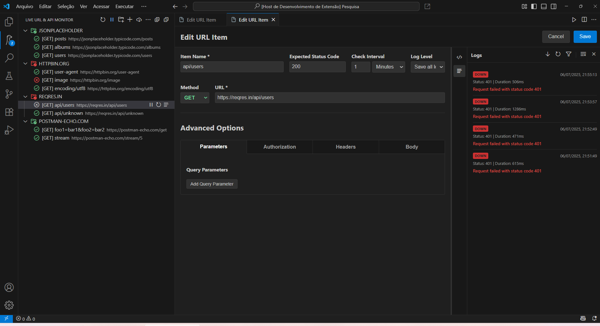

# Live API & URL Monitor

**Live API & URL Monitor** is a Visual Studio Code extension that monitors the availability and status of APIs and URLs in real time, directly within your development environment.

## Key Features

- **Continuous monitoring** with configurable intervals (seconds, minutes, or hours)
- **Tree view** with folder and subfolder support for organized item grouping
- **Real-time status indicators** showing the current state of each item
- **Native notifications** when services fail or recover
- **Full HTTP request support**: method, headers, query parameters, and request body
- **Advanced logging system** with per-item, per-folder, and global history
- **Import and export monitoring items** in JSON format
- **Import requests from a cURL command**; export any item as a cURL command
- **Pause and Resume** monitoring
- **Clean and accessible interface** with context menus and command palette integration

## Motivate us

If this is what you were looking for, please consider giving us a [5-star rating](https://marketplace.visualstudio.com/items?itemName=mlourenco.live-api-url-monitor&ssr=false#review-details).

We love suggestions. [Leave yours](https://github.com/marcelo-lourenco/live-api-url-monitor-extension/discussions/categories/ideas).

## Contributing

Contributions are welcome! Please feel free to submit [issues](https://github.com/marcelo-lourenco/live-api-url-monitor-extension/issues) and [pull requests](https://github.com/marcelo-lourenco/live-api-url-monitor-extension/fork).

## Resources and Information

[Code of Condut](https://github.com/marcelo-lourenco/live-api-url-monitor-extension?tab=coc-ov-file#readme) • [License MIT](https://github.com/marcelo-lourenco/live-api-url-monitor-extension?tab=MIT-1-ov-file#readme) • [Security](https://github.com/marcelo-lourenco/live-api-url-monitor-extension/security/policy) • [Changelog](https://github.com/marcelo-lourenco/live-api-url-monitor-extension/blob/master/CHANGELOG.md) • [Discussions](https://github.com/marcelo-lourenco/live-api-url-monitor-extension/discussions)

---

**Live API & URL Monitor** helps developers monitor APIs in real time—without leaving VS Code.
